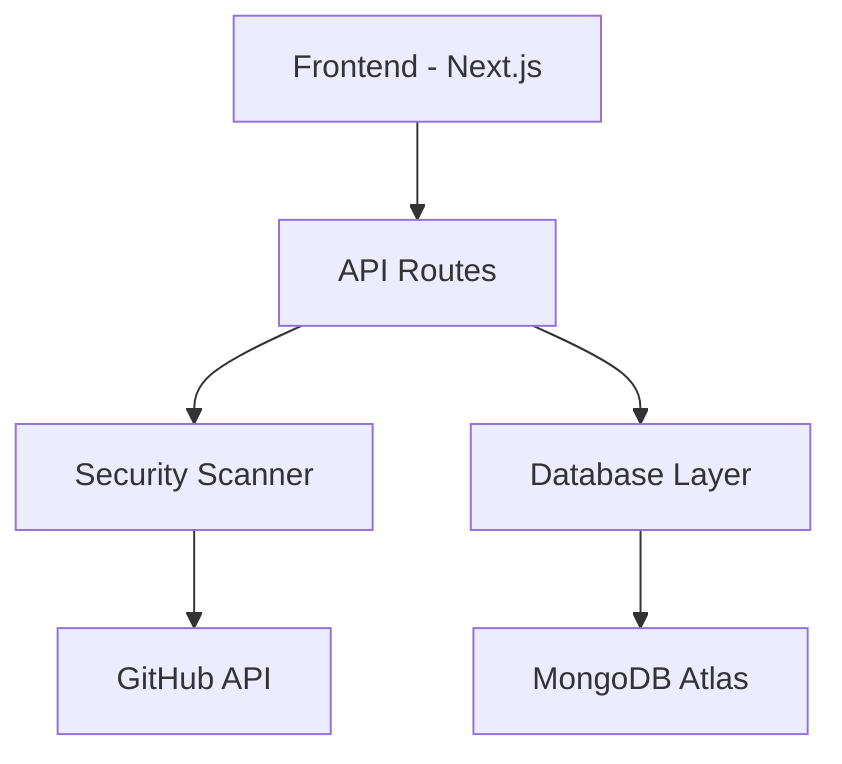

# DevSecGuard Technical Documentation

## Architecture Overview

### Core Components



1. **Frontend Layer**
   - Next.js 14 App Router
   - React components for UI
   - TailwindCSS for styling
   - React Query for state management
   - Chart.js for visualizations

2. **API Layer**
   - Next.js API Routes
   - RESTful endpoints
   - Protected routes with NextAuth.js
   - Rate limiting and error handling

3. **Security Scanner**
   - Pattern matching engine
   - Vulnerability detection
   - Code analysis
   - Results aggregation

4. **Database Layer**
   - MongoDB Atlas integration
   - Connection pooling
   - Data persistence
   - Query optimization

## Technical Specifications

### Frontend Architecture

1. **Component Structure**
   ```
   components/
   ├── Navigation.tsx        # Main navigation component
   ├── Providers.tsx        # React Query and Auth providers
   ├── ScanFilters.tsx      # Scan result filtering
   ├── ScanHistory.tsx      # Historical scan display
   ├── ScanSorting.tsx      # Scan result sorting
   ├── ScanStats.tsx        # Scan statistics and charts
   └── StateDisplay.tsx     # Application state display
   ```

2. **State Management**
   - React Query for server state
   - Local state for UI components
   - NextAuth.js for authentication state
   - Optimistic updates for better UX

3. **Data Flow**
   - Server-side rendering for initial load
   - Client-side updates through React Query
   - Real-time updates for scan status
   - Cached responses for better performance

### API Architecture

1. **Endpoints**
   ```
   /api/
   ├── auth/              # Authentication endpoints
   │   └── [...nextauth] # NextAuth.js configuration
   ├── scan/             # Scanning functionality
   │   └── route.ts      # Scan execution and results
   └── history/          # Scan history management
       └── route.ts      # Historical data retrieval
   ```

2. **Authentication Flow**
   - GitHub OAuth 2.0 integration
   - Session-based authentication
   - JWT token handling
   - Secure cookie management

3. **Request/Response Format**
   ```typescript
   // Scan Request
   interface ScanRequest {
     repositoryUrl: string;
     scanType: 'full' | 'quick';
     options?: ScanOptions;
   }

   // Scan Response
   interface ScanResponse {
     scanId: string;
     status: 'success' | 'error';
     findings: Finding[];
     metadata: ScanMetadata;
   }
   ```

### Database Schema

1. **Collections**
   ```typescript
   // Scans Collection
   interface Scan {
     _id: ObjectId;
     repositoryUrl: string;
     timestamp: Date;
     status: string;
     findings: Finding[];
     metadata: ScanMetadata;
   }

   // Users Collection
   interface User {
     _id: ObjectId;
     email: string;
     githubId: string;
     scans: ObjectId[];
     preferences: UserPreferences;
   }
   ```

2. **Indexes**
   - Compound index on `repositoryUrl` and `timestamp`
   - Text index on findings for search
   - TTL index for temporary data

## Security Implementation

### 1. Authentication Security
- OAuth 2.0 implementation
- CSRF token protection
- Secure session handling
- HTTP-only cookies

### 2. API Security
- Rate limiting
- Request validation
- Input sanitization
- Error handling

### 3. Data Security
- TLS/SSL encryption
- Data encryption at rest
- Secure credential storage
- Access control implementation

## Performance Optimization

### 1. Frontend Optimization
- Code splitting
- Image optimization
- CSS purging
- Bundle size optimization

### 2. API Optimization
- Response caching
- Connection pooling
- Query optimization
- Batch processing

### 3. Database Optimization
- Proper indexing
- Query optimization
- Connection pooling
- Cache implementation

## Monitoring and Logging

### 1. Performance Monitoring
- API response times
- Database query performance
- Frontend load times
- Resource utilization

### 2. Error Tracking
- API error logging
- Frontend error boundaries
- Database operation errors
- Security incident logging

### 3. Metrics Collection
- User engagement metrics
- Scan performance metrics
- System health metrics
- Security metrics

## Testing Strategy

### 1. Unit Testing
- Component testing
- Utility function testing
- API route testing
- Database operation testing

### 2. Integration Testing
- API integration tests
- Authentication flow testing
- Database integration tests
- Frontend integration tests

### 3. End-to-End Testing
- User flow testing
- Security scanning testing
- Error handling testing
- Performance testing

## Deployment Configuration

### 1. Development
- Local development setup
- Hot reloading
- Development database
- Debug configuration

### 2. Staging
- Staging environment setup
- Integration testing
- Performance testing
- Security testing

### 3. Production
- Production build process
- SSL/TLS configuration
- Database configuration
- Monitoring setup

## Maintenance and Updates

### 1. Dependency Management
- Regular dependency updates
- Security patch management
- Compatibility testing
- Version control

### 2. Database Maintenance
- Regular backups
- Index optimization
- Data cleanup
- Performance monitoring

### 3. Security Updates
- Security patch management
- Vulnerability scanning
- Access control review
- Security audit logging